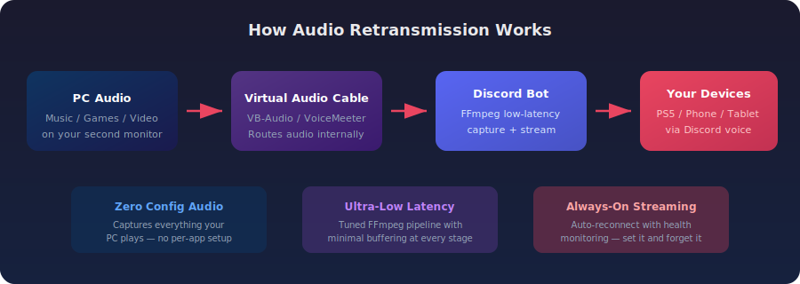

<p align="center">
  
  
  
  
</p>

<h1 align="center">Audio Retransmission</h1>

<p align="center">
  <b>Stream your PC audio to a Discord voice channel in real time with ultra-low latency.</b><br/>
  Perfect for hearing your PC through your PS5, phone, or any device that runs Discord.
</p>

<p align="center">
  
</p>

---

## What is this?

A lightweight Discord bot that captures your PC's audio output through a virtual audio cable and retransmits it into a Discord voice channel — in real time with minimal delay.

**The main use case:** You're gaming on PS5 with Discord open, but you also want to hear your PC (music, videos, game audio from your second monitor). This bot bridges that gap — your PC audio plays through the Discord voice channel, and you hear it on any connected device.

---

## Features

| Feature | Description |
|---|---|
| **Ultra-Low Latency** | Optimized FFmpeg pipeline with tuned buffers — audio delay is barely perceptible |
| **Auto-Reconnect** | Drops happen — the bot reconnects automatically with exponential backoff |
| **Fully Configurable** | Every setting lives in a `.env` file — tweak latency, priority, devices, and more |
| **Secure by Design** | No hardcoded tokens — secrets stay in `.env` which is git-ignored |
| **Process Priority Boost** | Optionally runs at Realtime or High priority to minimize jitter |
| **Self-Deafened** | Bot deafens itself by default to prevent echo loops |
| **Health Monitoring** | Continuously checks the audio stream and restarts it if it stops |
| **Quality Presets** | Choose from Low, Balanced, High, or Ultra — zero latency impact |
| **Bad Internet Mode** | Enables Opus FEC + reduced bitrate for unstable connections |
| **Clean Codebase** | Clear function names, full documentation — easy to read and modify |
| **Minimal Footprint** | Only enables the Discord intents it actually needs |

---

## How It Works

```
PC Audio Output
      |
      v
Virtual Audio Cable (VB-Audio / VoiceMeeter)
      |
      v
FFmpeg (DirectShow capture, ultra-low latency)
      |
      v
Discord Bot → Voice Channel
      |
      v
Any device on Discord (PS5, phone, tablet...)
```

1. A **virtual audio cable** (like [VB-Audio](https://vb-audio.com/Cable/)) routes your PC audio to a virtual input device
2. **FFmpeg** captures from that device with aggressively tuned low-latency settings
3. The **Discord bot** streams the raw PCM audio into your voice channel
4. You join the same channel on your **PS5 / phone / other device** and hear everything

---

## Quick Start

### Prerequisites

- **Python 3.10+** — [Download](https://www.python.org/downloads/)
- **FFmpeg** — [Download](https://ffmpeg.org/download.html) (place `ffmpeg.exe` in the project folder, or set the path in `.env`)
- **VB-Audio Virtual Cable** — [Download](https://vb-audio.com/Cable/) (free)
- **A Discord Bot** — [Create one here](https://discord.com/developers/applications)

### 1. Clone the repo

```bash
git clone https://github.com/Gonic1/audio-retransmission.git
cd audio-retransmission
```

### 2. Install dependencies

```bash
pip install -r requirements.txt
```

### 3. Configure

```bash
cp .env.example .env
```

Open `.env` and fill in:
- `BOT_TOKEN` — your Discord bot token
- `VOICE_CHANNEL_ID` — right-click the voice channel in Discord → **Copy Channel ID**
- `AUDIO_DEVICE` — the name of your virtual cable (check Windows Sound settings)

### 4. Run

```bash
python bot.py
```

The bot will connect and start streaming. You'll see:
```
[PRIORITY] High — reduced latency jitter.
[BOT] Logged in as YourBot#1234
[STREAM] Connecting to #your-channel (Your Server)...
[STREAM] Audio streaming started.
```

---

## Configuration Reference

All settings live in your `.env` file. Only `BOT_TOKEN` and `VOICE_CHANNEL_ID` are required.

| Variable | Default | Description |
|---|---|---|
| `BOT_TOKEN` | *required* | Your Discord bot token |
| `VOICE_CHANNEL_ID` | *required* | Target voice channel ID |
| `AUDIO_DEVICE` | `CABLE Output (VB-Audio Virtual Cable)` | Virtual audio cable device name |
| `FFMPEG_PATH` | `ffmpeg.exe` | Path to FFmpeg binary |
| `AUDIO_BUFFER_SIZE` | `10` | DirectShow buffer in ms (lower = less delay) |
| `PROBE_SIZE` | `32` | FFmpeg probe size in bytes |
| `THREAD_QUEUE_SIZE` | `32` | FFmpeg read thread queue depth |
| `RT_BUFFER_SIZE` | `64k` | Real-time capture buffer |
| `RECONNECT_DELAY` | `2` | Initial reconnect delay (seconds) |
| `MAX_RECONNECT_DELAY` | `30` | Maximum reconnect backoff (seconds) |
| `HEALTH_CHECK_INTERVAL` | `0.5` | Stream health poll interval (seconds) |
| `PROCESS_PRIORITY` | `high` | Process priority: `realtime`, `high`, or `normal` |
| `AUDIO_QUALITY` | `balanced` | Quality preset: `low`, `balanced`, `high`, `ultra` |
| `BAD_INTERNET` | `false` | Enable FEC + forced mono 32kbps for unstable connections |
| `SELF_DEAF` | `true` | Deafen the bot in voice chat |

### Audio Quality Presets

| Preset | Bitrate | Channels | Best for |
|---|---|---|---|
| `low` | 32 kbps | Mono | Saving bandwidth, voice-only content |
| `balanced` | 64 kbps | Stereo | General use — music, games, videos (default) |
| `high` | 96 kbps | Stereo | High-fidelity music streaming |
| `ultra` | 128 kbps | Stereo | Maximum quality Discord supports |

> All presets produce **zero additional latency** — Opus always encodes in fixed 20ms frames regardless of bitrate.

### Bad Internet Mode

Set `BAD_INTERNET=true` if your connection is unstable. This enables:
- **Opus FEC** (Forward Error Correction) — embeds recovery data so lost packets can be reconstructed from the next one
- **Forced 32kbps mono** — reduces bandwidth requirements
- **25% expected packet loss** — tells Opus to optimize for lossy conditions

FEC is built into the Opus codec and adds **no extra latency** — it's recovery data piggybacked onto existing packets.

### Latency Tuning Tips

- **`AUDIO_BUFFER_SIZE=10`** is the sweet spot for most systems. Go lower (5) if you have a fast CPU, higher (20-50) if you hear crackling
- **`PROCESS_PRIORITY=realtime`** gives the best latency but requires running as Administrator
- **`HEALTH_CHECK_INTERVAL=0.5`** means the bot detects a dead stream within half a second

---

## Setting Up the Virtual Audio Cable

1. Install [VB-Audio Virtual Cable](https://vb-audio.com/Cable/)
2. Open **Windows Sound Settings**
3. Set your default playback device to **CABLE Input** (this routes audio into the cable)
4. The bot captures from **CABLE Output** (the other end of the cable)

> **Tip:** If you want to hear audio on your PC *and* stream it, use [VoiceMeeter](https://vb-audio.com/Voicemeeter/) to split the output to both your speakers and the virtual cable.

---

## Discord Bot Setup

1. Go to the [Discord Developer Portal](https://discord.com/developers/applications)
2. Click **New Application** → name it anything
3. Go to **Bot** → click **Reset Token** → copy the token into your `.env`
4. Under **Privileged Gateway Intents**, no special intents are needed
5. Go to **OAuth2 → URL Generator**:
   - Scopes: `bot`
   - Permissions: `Connect`, `Speak`
6. Open the generated URL to invite the bot to your server

---

## Project Structure

```
audio-retransmission/
├── bot.py              # Main bot — the only file you need to run
├── .env.example        # Configuration template
├── .env                # Your local config (git-ignored)
├── requirements.txt    # Python dependencies
├── ffmpeg.exe          # FFmpeg binary (git-ignored, download separately)
├── LICENSE             # MIT License
└── README.md
```

---

## Troubleshooting

| Problem | Solution |
|---|---|
| `BOT_TOKEN is missing` | Create a `.env` file from `.env.example` and add your token |
| `FFmpeg not found` | Download FFmpeg and place `ffmpeg.exe` in the project folder |
| `Channel not found` | Make sure `VOICE_CHANNEL_ID` is correct and the bot is in the server |
| Audio crackling | Increase `AUDIO_BUFFER_SIZE` to `20` or `50` |
| High delay | Decrease `AUDIO_BUFFER_SIZE`, set `PROCESS_PRIORITY=realtime`, run as admin |
| Bot keeps reconnecting | Check that your virtual audio cable is installed and the device name matches |

---

## License

MIT License — see [LICENSE](LICENSE) for details.

---

<p align="center">
  Made by <b>Blank</b>
</p>
